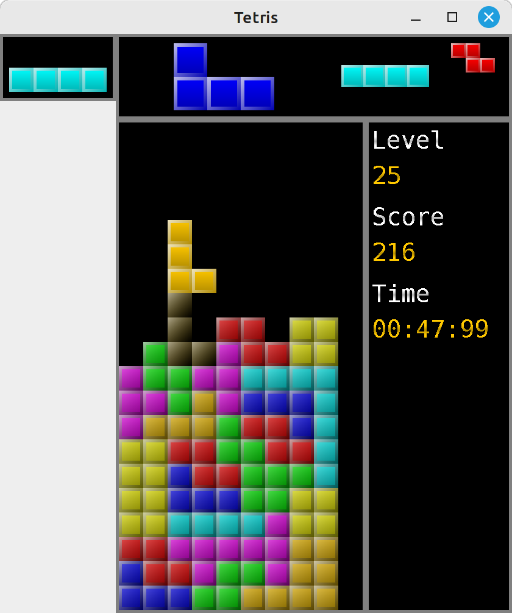

# Tetris


[](https://www.gnu.org/licenses/gpl-3.0)

## Description
Many years ago, I wanted to make a decent Tetris clone with only Swing.
Like most of my projects, it ended up being abandoned, unfinished.
Recently, I found some motivation after seeing the movie Tetris (2023), and I took this old project out of its box.

## Getting Started
These instructions will get you a copy of the project up and running on your local machine for development and testing
purposes, and eventually for fun.
UI should automatically scale based on screen resolution.

### Prerequisites
* Java 20+
* Maven 3.8.1+
* Git 2.34.1+

### Installing and running
* Clone the repository from GitHub:
```shell
git clone https://github.com/Achaaab/tetris.git
```
* Compile
```shell
cd tetris
mvn package
```
* Run
```shell
java -jar target/tetris-0.0.0.jar
```

### Usage
Keys are configurable in properties, but not in-game.
* [SPACE]: rotate the falling piece clockwise
* [SHIFT]: rotate the falling piece counterclockwise
* [UP]: hard drop the falling piece
* [DOWN]: soft drop the falling piece
* [LEFT]: move the falling piece to the left (auto-repeat after delay)
* [RIGHT]: move the falling piece to the right (auto-repeat after delay)
* [P]: pause the game

### Screenshot


## Improvements
The list of improvements and missing features is immeasurable.

## Contributing
Slow-mode project, probably doomed not to be finished. Contributions are still welcome.

## Authors
* **Jonathan Guéhenneux** - *Developer* - [Achaaab](https://github.com/Achaaab)
* **Jonathan Guéhenneux** - *Crappy sound designer* - [Achaaab](https://github.com/Achaaab)

## License
This project is licensed under the GNU General Public License (GPL) - see the [LICENSE.md](LICENSE.md) for the details.
