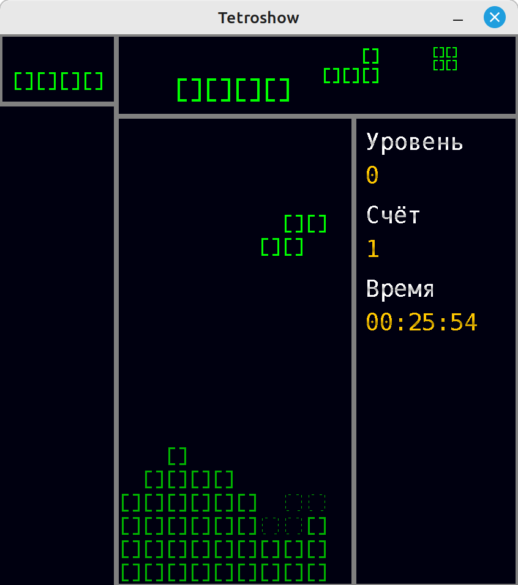

# Tetroshow


[](https://www.gnu.org/licenses/gpl-3.0)

## Description
Tetroshow is a puzzle game where the goal is to arrange tetrominos appearing on the screen to form complete lines
in a limited playfield.

## Getting Started
These instructions will get you a copy of the project up and running on your local machine for development and testing
purposes, and eventually for fun.
UI should automatically scale based on screen resolution.

### Prerequisites
* Java 20+
* Maven 3.8.1+
* Git 2.34.1+

### Installing and running
* Clone the repository from GitHub:
```shell
git clone https://github.com/Achaaab/tetroshow.git
```
* Compile
```shell
cd tetroshow
mvn package
```
* Run
```shell
java -jar target/tetroshow-0.0.0.jar
```

### Usage
Keys are configured in [tetroshow.yaml](src/main/resources/tetroshow.yaml), but they are not yet configurable in game.
* <kbd>Space</kbd> rotate the falling piece clockwise
* <kbd>Shift</kbd> rotate the falling piece counterclockwise
* <kbd>↑</kbd> hard drop the falling piece
* <kbd>↓</kbd> soft drop the falling piece
* <kbd>←</kbd> move the falling piece to the left
* <kbd>→</kbd> move the falling piece to the right
* <kbd>P</kbd> pause the game
* <kbd>Esc</kbd> exit the game

### Screenshots



## Improvements
The list of improvements and missing features is immeasurable.

## Contributing
Slow-mode project, probably doomed not to be finished. Contributions are still welcome.

## Authors
* **Jonathan Guéhenneux** - *Programmer* - [Achaaab](https://github.com/Achaaab)

## License
This project is licensed under the GNU General Public License (GPL) - see the [LICENSE.md](LICENSE.md) for the details.

## Acknowledgments
* [AudioCue](https://github.com/philfrei/AudioCue-maven): [Phil Freihofner](https://adonax.com/)
* Background music via: [Fesliyan Studios](https://www.FesliyanStudios.com)
* [sfxr](https://www.drpetter.se/project_sfxr.html): Tomas Pettersson
* Japanese translation: Matthew Paddick
* Fonts via: [1001 Fonts](https://www.1001fonts.com)
* Font "Digital-7": Sizenko Alexander, [Style-7](http://www.styleseven.com)
* Font "Monofonto": Raymond Larabie
